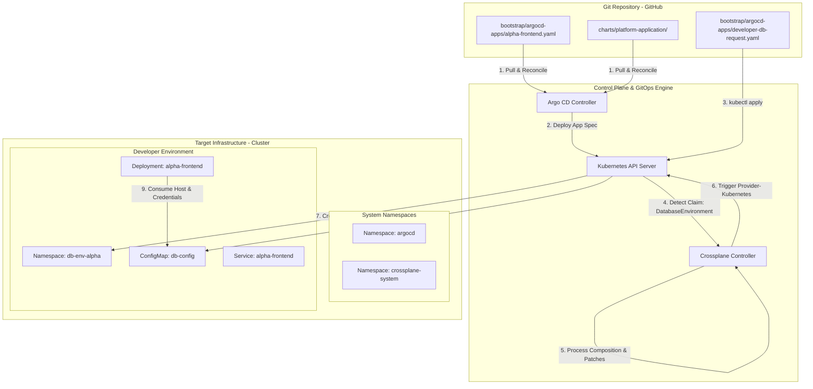
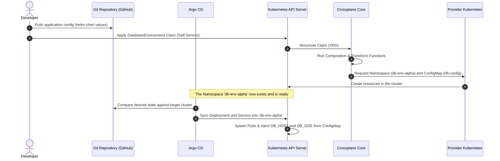

# Internal Developer Platform (IDP) Core: GitOps & Control Plane Lab

This repository contains the reference architecture and declarative infrastructure definitions for a modern **Internal Developer Platform (IDP)**. 

The primary goal of this lab is to demonstrate how combining **GitOps (via Argo CD)** and an **infrastructure Control Plane (via Crossplane)** enables a secure, consistent, and fully automated **developer self-service infrastructure** model.

---

## Platform Architecture

The platform is designed following the **Platform as a Product** philosophy, abstracting infrastructure complexity away from developers while the Platform Engineering team defines policies, standards, and guardrails.

### Architecture Block Diagram

The diagram below details how the development specifications, GitOps synchronization, Crossplane controller, and Kubernetes cluster interact:



---

## Self-Service Workflow & Lifecycle

The provisioning lifecycle follows an automated, decoupled sequence:



### Key Workflow Highlights:
1. **Separation of Concerns**: The developer requests a database in an agnostic way (via a `DatabaseEnvironment` claim) without having to know which physical provider will create it.
2. **Dynamic Provisioning**: The Control Plane (Crossplane) dynamically creates an isolated namespace (`db-env-alpha`) and a `ConfigMap` (`db-config`) containing the database connection metadata.
3. **GitOps-driven Deployment**: Argo CD detects the new namespace and synchronizes the application manifests into it.
4. **Hot Binding**: The application directly consumes environment variables injected from the provisioned ConfigMap, achieving seamless integration.

---

## Project Structure

```text
├── bootstrap/
│   └── argocd-apps/
│       ├── alpha-frontend.yaml       # Argo CD Application definition (Team Alpha)
│       └── developer-db-request.yaml # Example DatabaseEnvironment claim for developers (Self-Service)
├── charts/
│   └── platform-application/         # Generic and secure Helm chart for developer applications
│       ├── Chart.yaml
│       ├── values.yaml
│       └── templates/
│           ├── deployment.yaml       # Deployment template (with dynamic environment variables)
│           ├── ingress.yaml          # Ingress rule template
│           ├── service.yaml          # Kubernetes Service template
│           └── crossplane-function.yaml
├── crossplane/
│   └── apis/
│       ├── definition.yaml           # CompositeResourceDefinition (XRD) for DatabaseEnvironment
│       ├── composition.yaml          # Composition implementing the logic (Namespace + ConfigMap)
│       └── function.yaml             # Composition patch-and-transform function declaration
└── providers/
    ├── crossplane-provider.yaml      # Kubernetes provider installation manifest
    └── crossplane-provider-config.yaml # Provider configuration using InjectedIdentity authentication
```

---

## Bootstrapping & Installation Guide

Follow these steps to bootstrap the platform in a local Kubernetes cluster (e.g., using **Kind** or **Minikube**):

### Step 0: Install Crossplane in the Cluster
Install Crossplane in its designated namespace using Helm:
```bash
# Add Helm Repository
helm repo add crossplane-stable https://charts.crossplane.io/stable
helm repo update

# Install Crossplane
helm install crossplane --namespace crossplane-system --create-namespace crossplane-stable/crossplane
```

### Step 1: Install Crossplane Providers and Functions
Apply the provider and composition function to the cluster:
```bash
# Install the Kubernetes provider
kubectl apply -f providers/crossplane-provider.yaml

# Install the patch-and-transform composition function
kubectl apply -f crossplane/apis/function.yaml
```

### Step 2: Configure Provider Authentication
Configure the provider to use the cluster's internal service account credentials (`InjectedIdentity`) and grant it administrative cluster privileges:
```bash
# Apply the default ProviderConfig
kubectl apply -f providers/crossplane-provider-config.yaml

# Grant cluster-admin permissions to the provider's ServiceAccount
SA_NAME=$(kubectl -n crossplane-system get sa -o name | grep provider-kubernetes | cut -d'/' -f2)
kubectl create clusterrolebinding provider-kubernetes-admin-binding \
  --clusterrole cluster-admin \
  --serviceaccount=crossplane-system:${SA_NAME}
```

### Step 3: Apply Platform APIs (XRD and Composition)
Establish the self-service API resource definition and the composition logic:
```bash
# Establish the custom resource definition (XRD)
kubectl apply -f crossplane/apis/definition.yaml

# Apply the Composition
kubectl apply -f crossplane/apis/composition.yaml
```

---

## Platform Usage Guide (Hands-On Verification)

### 1. Request a Developer Environment (Self-Service)
As a developer, apply the database claim:
```bash
kubectl apply -f bootstrap/argocd-apps/developer-db-request.yaml
```

### 2. Verify Resource Generation by Crossplane
Monitor how Crossplane processes the claim, creates the namespace, and generates the configmap:
```bash
# Validate the database claim status
kubectl get databaseenvironments -n default

# Validate that the namespace was dynamically created
kubectl get ns db-env-alpha

# Validate that the ConfigMap containing connection parameters was injected
kubectl get configmap -n db-env-alpha db-config -o yaml
```

### 3. Verify Argo CD Deployment
Verify the application sync status, retrieve the admin password, and access the Argo CD dashboard:
```bash
# Check the application status in Argo CD
kubectl get application -n argocd alpha-frontend

# List the application pods running in the provisioned namespace
kubectl get pods -n db-env-alpha

# Get the initial admin password (Username: admin)
# For Linux/macOS:
kubectl -n argocd get secret argocd-initial-admin-secret -o jsonpath="{.data.password}" | base64 -d

# For Windows PowerShell:
[System.Text.Encoding]::UTF8.GetString([System.Convert]::FromBase64String((kubectl -n argocd get secret argocd-initial-admin-secret -o jsonpath="{.data.password}")))

# Port-forward to access Argo CD UI at http://localhost:8888
kubectl port-forward svc/argocd-server -n argocd 8888:443
```

---

## Technical Interview Highlights

If you are presenting this project in a technical interview, here are the key concepts this repository showcases:

- **Platform Engineering & Modern IDPs**: Rather than writing ad-hoc Terraform or Jenkins scripts, this design leverages a control plane model with Kubernetes APIs to implement a true developer platform.
- **Control Plane Pattern**: Demonstrates how Crossplane extends the Kubernetes API to manage logical and physical resources using the **Composition / Composite Resource Definition (XRD)** pattern.
- **Pure GitOps**: Uses Argo CD to manage the application lifecycle, maintaining the declarative configuration in Git as the single source of truth.
- **Multi-tenant Isolation & Security**: Applications are dynamically isolated into dedicated namespaces per claim, injecting secrets and configs without granting developers broad cluster access.
- **Dry-run & Template Hardening**: Hardened Helm chart layout and templating (indentation alignment) to ensure valid YAML rendering under mixed integration scenarios.

---

## Author

- **Roberto Palacios** - [LinkedIn](https://www.linkedin.com/in/robpalacios1/)